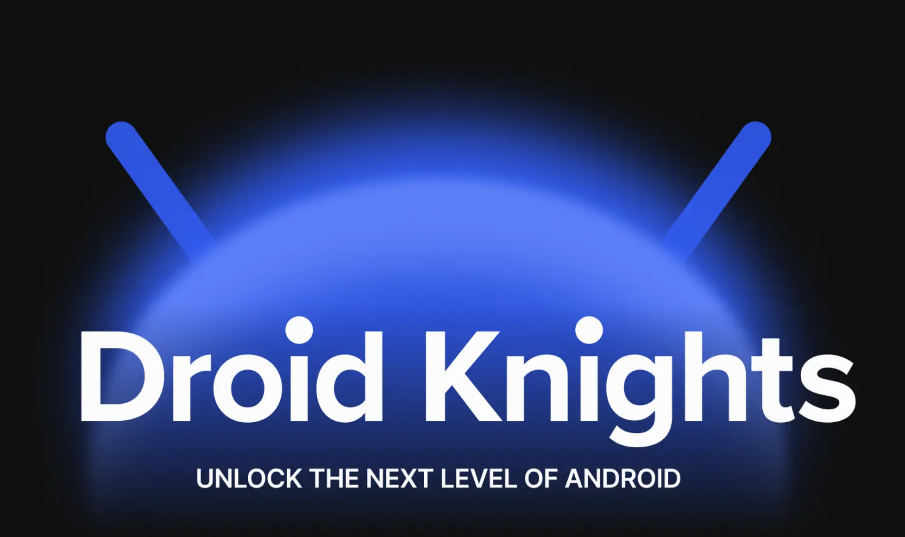
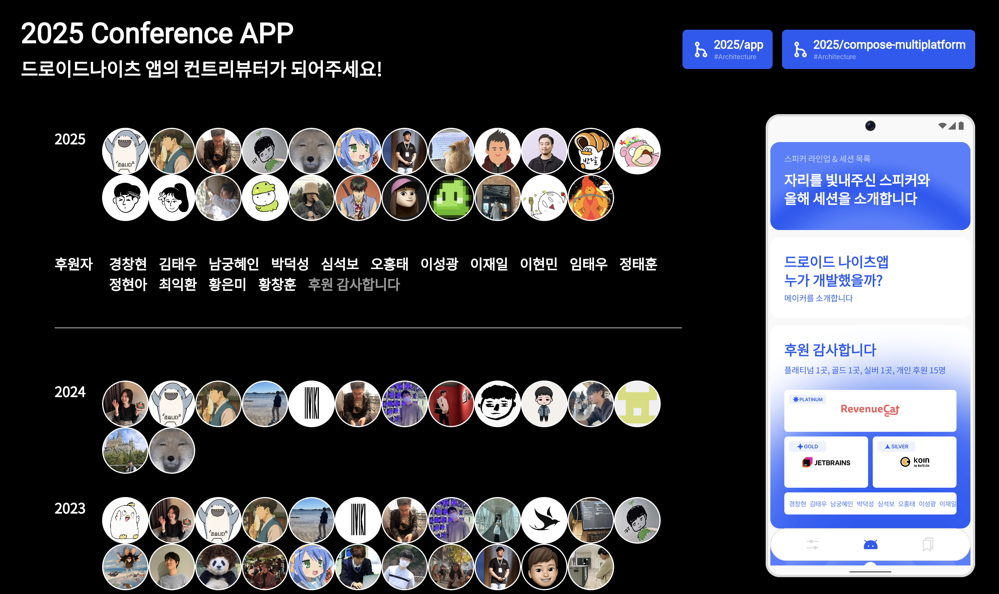
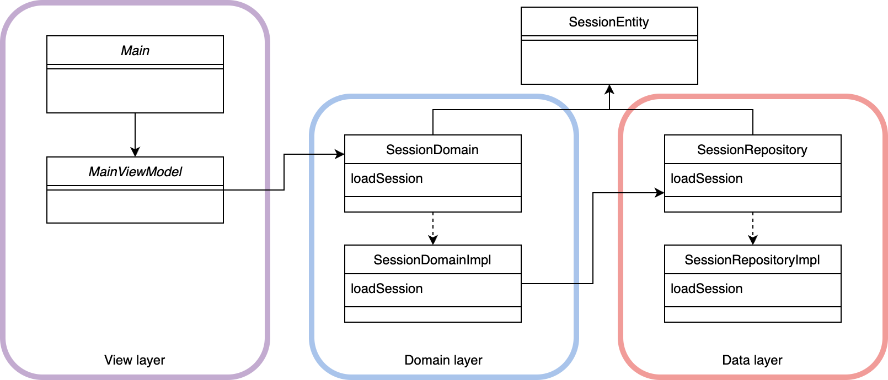
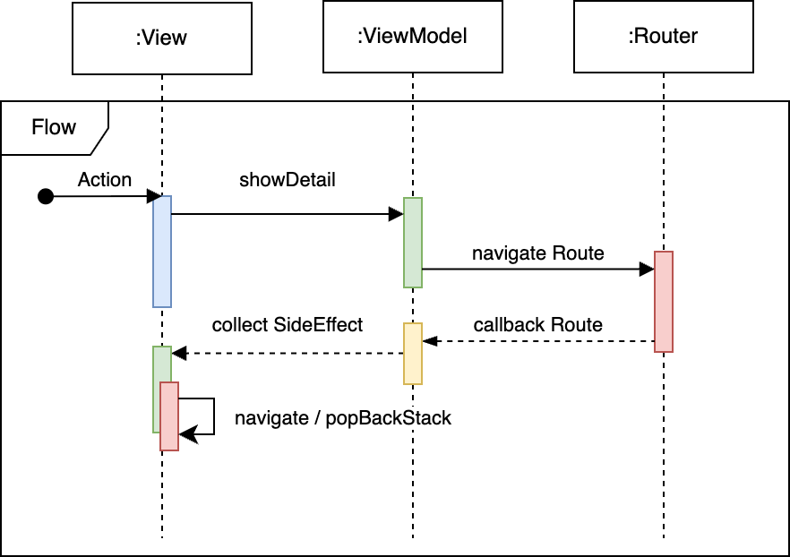
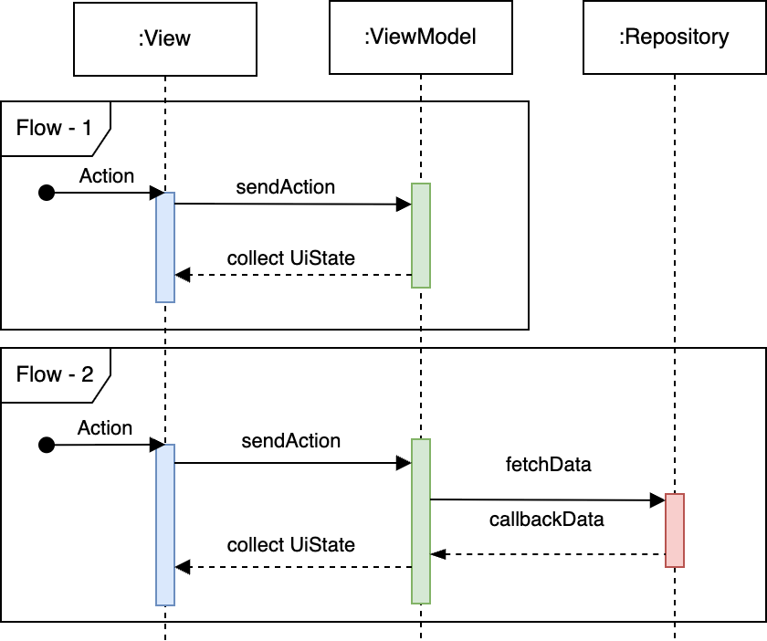
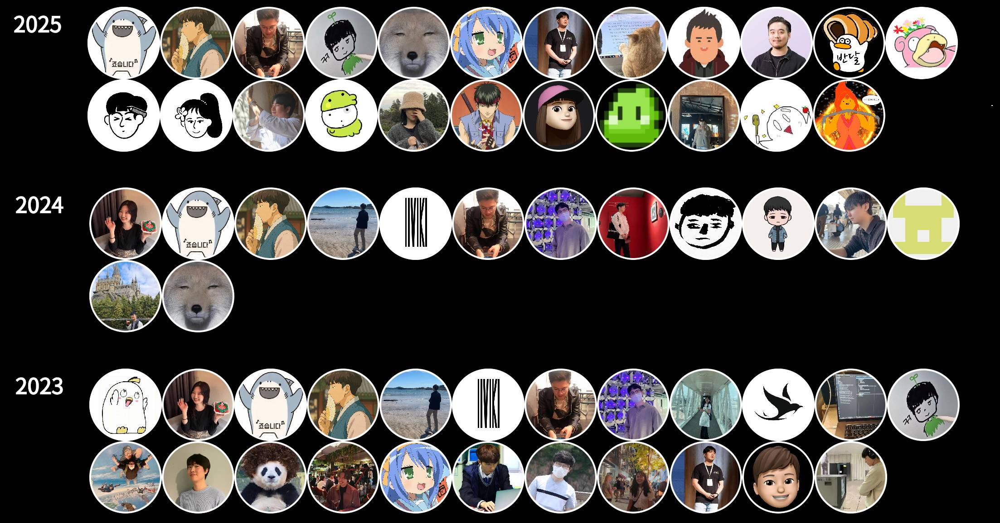

# DroidKnights App

드로이드나이츠는 기술 세션으로 개발자들의 경험을 공유하는 안드로이드 컨퍼런스입니다.

2025 DroidKnights App은 아래 두 가지 버전으로 개발되었습니다.

- [기존 앱의 아키텍처 변경 - New 2025](https://github.com/droidknights/DroidKnightsApp/tree/2025/app)
- [DroidKnights X Compose Multiplatform 🚀 - CMP로 만들어 본 2025 DroidKnights App](https://github.com/droidknights/DroidKnightsApp/tree/2025/compose-multiplatform)

## 🌐 CMP로 바로 확인하기!

- [CMP 덕에 웹에서도 바로 확인 가능해요!](https://droidknights.github.io/DroidKnightsApp/)

## 👩‍💻 Guide

### Contributions Welcome!

드로이드나이츠 행사 정보를 볼 수 있는 앱을 함께 만들고 있습니다. 여러분의 참여로 더 나은 앱을 만들어 나가길 기대합니다!

자세한 내용은 [CONTRIBUTING.md](CONTRIBUTING.md) 를 참고해 주세요.

## 🎨 Design

[Figma](https://www.figma.com/design/vyeqzTzAkrn22rCDxvs0I3/%EB%93%9C%EB%A1%9C%EC%9D%B4%EB%93%9C%EB%82%98%EC%9D%B4%EC%B8%A0-%EC%96%B4%ED%94%8C%EB%A6%AC%EC%BC%80%EC%9D%B4%EC%85%98?node-id=120-1657)에서 디자인을 확인하실 수 있습니다.

## 🛠️ Development

### Required

- IDE : Android Studio 최신 버전 ([Download](https://developer.android.com/studio))
- JDK : Java 21을 실행할 수 있는 JDK

  - (권장) Android Studio 설치 시 Embeded 된 JDK (Open JDK)
  - KMP 코드 확인 시 플러그인 필수
  - Java 21을 사용하는 JDK (Open JDK, AdoptOpenJDK, GraalVM)

- Kotlin Language : 2.1.21

#### Gradle Dependency

[Gradle Version Catalog](https://docs.gradle.org/current/userguide/platforms.html) 를 활용하여 종속성과 플러그인을 관리하고 있습니다.

- [App - libs.versions.toml](https://github.com/droidknights/DroidKnightsApp/blob/2025/app/gradle/libs.versions.toml)
- [CMP - librs.versions.toml](https://github.com/droidknights/DroidKnightsApp/blob/2025/compose-multiplatform/gradle/libs.versions.toml)

## 🏗️ Architecture

## Q. App과 CMP를 왜 구분해서 작업했나요?

2025 드로이드나이츠 앱은 기존 앱의 유연한 아키텍처 개선을 목표로 했고, 동시에 Compose Multiplatform을 통한 다양한 타겟(Android, iOS, Desktop, Web)의 앱도 함께 보여드리고 싶었습니다.

이번 작업은 Clean Architecture를 기반으로 작성했습니다.

- `View Layer`: View - ViewModel
- `Domain Layer`: Domain에 대한 interface 모듈, Domain에 대한 구현체
- `Data Layer`: Repository에 대한 interface 모듈, Repository에 대한 구현체

모든 레이어에서 `api 모듈`을 분리하여 View Layer에서는 Domain Layer만 바라보도록 설계했고, 이를 통해 구현체의 변경이 상위 레이어에 미치는 영향을 최소화했습니다. Now in Android 샘플을 참고하여, View가 모든 데이터에 접근하는 구조가 아니라 각 화면에 딱 필요한 데이터 구조만을 바라보도록 구성했습니다.

결국 아래 그림과 같은 구조를 지향합니다.

`api 모듈`을 별도로 분리함으로써 필요한 구조만을 가져다 사용할 수 있는 이점과 리빌드 성능 개선에도 도움됩니다.

Main을 기준으로 Flow를 간략하게 표현하면 아래와 같습니다.

## Q. 정말 이점이 있나요?

네, 리빌드 시간 단축의 이점은 분명히 있습니다. 보통 30초 미만으로 리빌드하며 작업할 수 있는 환경을 제공합니다. (물론 최초 빌드 시에는 시간이 더 소요됩니다.)

## Q. domain의 구현체를 수정했다면 영향도는?

domain의 구현체 모듈을 수정했으므로, 이를 직접 의존하는 `app 모듈`만 영향을 받습니다.

## Q. Repository api를 수정했다면?

interface가 변경되었으니, 이를 참조하는 domain 구현체와 Repository 구현체에 영향을 미칩니다. View Layer에는 상황에 따라 영향이 생길 수도 있습니다.

## Q. View에도 api 모듈이 있던데요?

View의 `api 모듈`은 Router라는 개념을 활용하기 위해 존재합니다. 특정 화면으로 이동하려면 Now in Android(NIA)에서처럼 Navigator 모듈을 두거나 app 모듈에서 라우팅을 처리해야 합니다.

Router 모듈을 활용하면 이러한 문제를 해결할 수 있습니다. 예를 들어, main 모듈의 Main 화면에서 시간표 화면으로 이동하는 경우, 클릭 이벤트는 MainViewModel로 전달되고, 공통 Router 객체를 통해 화면 이동이 처리됩니다.

이를 통해 각 피처 모듈이 다른 모듈의 화면으로 직접 라우팅할 필요가 없어집니다.

이에 대한 Flow는 아래와 같습니다.

## Action?

다소 생소할 수 있는 Action을 추가해보았습니다. MVI 패턴의 'Intent'와 유사한 개념입니다. Action 이후에 UiState를 반영할지 여부에서 차이가 있는데, 이번 프로젝트에서는 Setting 화면에만 Action을 적용했습니다.

기존에 View에서 ViewModel을 직접 호출하던 방식 대신, Action을 통해 ViewModel과 상호작용합니다. 데이터 흐름은 단방향 데이터 흐름(UDF, Unidirectional Data Flow)을 따릅니다.

적용한 Action의 플로우는 아래와 같습니다.

Action을 사용하지 않아도 동일한 구현이 가능하지만, `리액트(React)`의 개념을 더 적극적으로 활용해보고 싶어 적용했습니다.

## ✈️ Compose Multiplatform

Jetpack Compose는 대

## 아키텍처 Next...

api 모듈 분리와 Router/Action을 적용한 것처럼, 유사한 방식으로 Alert/Toast/Snackbar 역시 모두 적용이 가능합니다. 중요한 것은 데이터 흐름의 방향을 어떻게 설계하는가이며, 이를 잘 활용하면 더 많은 부분에서 재사용성과 테스트 용이성을 높일 수 있습니다.

`View -> ViewModel -> Some -> ViewModel -> View`

공통 UI 컴포넌트(Alert, Toast 등)를 여러 화면에서 사용하려면, 각 화면의 View와 상호작용할 수 있는 공통된 메커니즘이 필요합니다.

이러한 구조를 잘 활용하면 Unit Test가 용이한 코드를 작성할 수 있고, View의 동작에 신경 쓰지 않고 비즈니스 로직만으로도 충분히 기능을 검증할 수 있습니다.

## 🙏 Thanks

참여해주신 모든 분들 감사합니다!

- CMP Web app : [2025 conference app에서 Contributors 확인](https://droidknights.github.io/DroidKnightsApp/)
- Designer 2025 : 박수연
- Maintainer 2025 : [taehwandev](https://github.com/taehwandev), [workspace](https://github.com/workspace), Special Thanks: [HyunWoo Lee (Nunu Lee)](https://github.com/l2hyunwoo)
- Designer 2023 : Eunbi Ko
- Maintainer 2023 : [laco-dev](https://github.com/laco-dev), [wisemuji](https://github.com/wisemuji)

## ✨ Contributors

2023, 2024, 2025 모든 Contributors 분들께 감사드립니다!

> 목록에 없다면 꼭 PR 해주세요!

