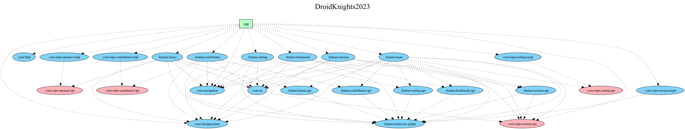

# DroidKnights App

드로이드나이츠는 기술 세션으로 개발자들의 경험을 공유하는 안드로이드 컨퍼런스입니다.

## Guide

### Contributions Welcome!

드로이드나이츠 행사 정보를 볼 수 있는 앱을 개발하고 있습니다. 여러분들의 참여로 함께 만들어 나가길 기대합니다!

자세한 내용은 [CONTRIBUTING.md](CONTRIBUTING.md) 를 참고해 주세요.

## Design

[Figma](https://www.figma.com/file/FL7CdEyPjvhkJrtYEHAbXn/2023-Droid-Knights-App-_-KEB?type=design&node-id=1%3A381&mode=design&t=rj6Nic9cJGOSccCH-1)에서 디자인을 확인하실 수 있습니다.

## Development

### Required

- IDE : Android Studio 최신 버전 ([Download](https://developer.android.com/studio))
- JDK : Java 17을 실행할 수 있는 JDK
  - (권장) Android Studio 설치 시 Embeded 된 JDK (Open JDK)
  - Java 17을 사용하는 JDK (Open JDK, AdoptOpenJDK, GraalVM)

- Kotlin Language : 2.0.0

### Language

- Kotlin

### Libraries

- AndroidX
  - Activity & Activity Compose
  - AppCompat
  - Core
  - Lifecycle & ViewModel Compose
  - Navigation

- Kotlin Libraries (Coroutine, DateTime, Serialization)
- Compose
  - Material3
  - Navigation

- Landscapist & Landscapist Coil
- Dagger & Hilt
- Square (Retrofit, OkHttp)

#### Test & Code analysis

- Compose Test(UI, Navigation)
- JUnit4
- Mockk
- Turbine
- Kotest
- Detekt

#### Gradle Dependency

[Gradle Version Catalog](https://docs.gradle.org/current/userguide/platforms.html) 를 활용하여 종속성과 플러그인을 관리하고 있습니다.

자세한 내용은 [libs.versions.toml](https://github.com/droidknights/DroidKnights2023_App/blob/main/gradle/libs.versions.toml) 를 참고해 주세요.

## Architecture

### Layer

본 프로젝트는 Layered Architecture 형태로 설계되어 있습니다. 현재 Presentation/Domain/Data 레이어 구조를 띄고 있습니다.


#### UI Layer

상태는 아래로 이동하고 이벤트는 위로 이동하는 단방향 데이터 흐름(UDF)으로 구성되어 있습니다.


### Module

본 프로젝트는 Multi-module 구조이며 각 Feature마다 모듈 형태로 구성되어 있습니다.



**Module Graph 생성 방법**

```
1. 그래프를 시각화하는 오픈소스 설치
- brew install graphviz (예시 Homebrew)

2. 그래프 생성 Gradle Task 실행
./gradlew projectDependencyGraph
```

## Thanks

참여해주신 모든 분들 감사합니다!

- GitHub : [Contributors](https://github.com/droidknights/DroidKnightsApp/graphs/contributors)
- Designer : Eunbi Ko
- Maintainer : [laco-dev](https://github.com/laco-dev), [wisemuji](https://github.com/wisemuji)
