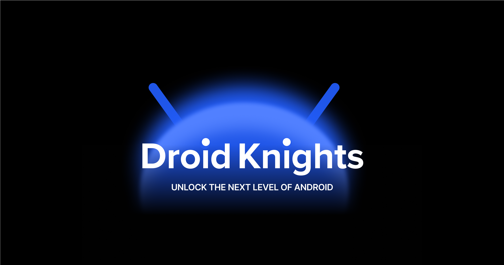
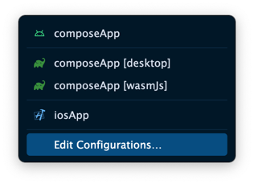
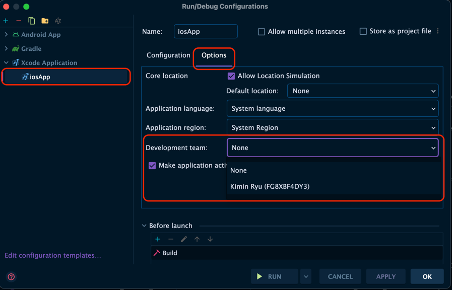

# DroidKnights 2025 Multiplatform App

Compose Multiplatform을 활용하여 기존 컨퍼런스 앱을 재구성했습니다. Compose Multiplatform 1.8을 체험하고, 논의하는 장이 되었으면 좋겠습니다.
- [공식 홈페이지](https://www.droidknights.dev/)
- [티켓 구입하기](https://www.ticketa.co/events/1)
- [드로이드나이츠 앱 소개 페이지 + 라이브 데모 by Compose Multiplatform (Wasm)](https://droidknights.github.io/DroidKnightsApp/)

## 개발 환경
- Android Studio
  - Narwhal Feature Drop Canary 최신
- JDK
  - (권장) Android Studio 설치 시 Embeded 된 JDK (JBR)
- Android Gradle Plugin 8.10.0
- Kotlin 2.1.21
- Compose Multiplatform 1.8.1

## Code Formatting
### Git Pre Commit hook 설치
코드 퀄리티 유지를 위해 `detekt`이 적용되어있습니다. 아래 스크립트를 실행하여 Git pre commit hook을 설치해주세요.
```sh
./scripts/install-hooks.sh
```
만약 실패한다면 아래 명령어를 실행하여 자동으로 오류를 수정하고, 수정되지 않는 것은 에러 로그를 보고 알맞게 수정 후 다시 확인합니다.

```
./gradlew detekt --auto-correct
```

## Run Configuration

[Kotlin Multiplatform Plugin](https://plugins.jetbrains.com/plugin/14936-kotlin-multiplatform) 설치가 필요합니다.

- composeApp
  - Android 에뮬레이터 or 실제 기기
  - (desktop) Windows / macOS / Linux
  - (wasmJs) localhost 웹
- iosApp
  - iOS 시뮬레이터 (xcode 설치 필요)



### iOS 실제 기기에 앱 설치 시 주의사항

1. 메뉴 - Run - Edit Configurations... 클릭
2. 아래 그림과 같이 Development Team이 설정 되어 있어야 합니다.
3. ⚠️pr 작성 시 해당 값이 저장되는 `project.pbxproj`이 수정되지 않도록 주의해 주세요!



### Intel Mac에서 프로젝트 빌드하는 법

현재 이 프로젝트는 Apple Silicon Mac에서 iOS 앱이 빌드되도록 기본 설정되어 있습니다.

Intel Mac에서 iOS 앱을 빌드하려면, 프로젝트의 local.properties 파일에 아래 설정을 추가해 주세요:

```properties
arch=X86_64
```
